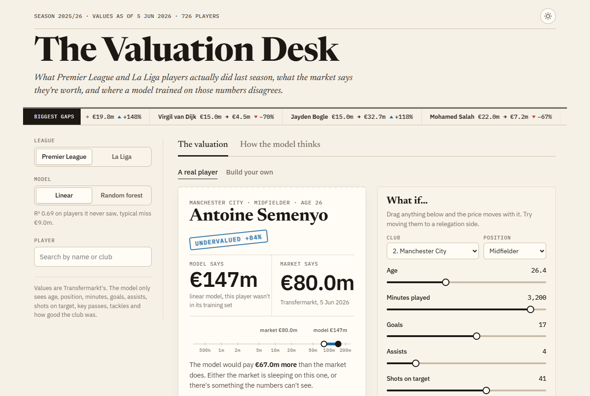

# transfer-value-predictor

What is a footballer actually worth, if all you go on is what they did on the pitch last season?

This takes every outfield player with 600+ minutes in the 2025/26 Premier League and La Liga, trains a model on their season stats against their Transfermarkt market value, and then looks at where the two disagree. The site (I've been calling it the Valuation Desk) lets you look up any player, see the model's price next to the market's, and drag sliders to see what would happen if they'd scored 10 more goals or played for a relegation side.



## What's in it

- **The valuation**: pick a player, get the model's number, the market's number and a verdict (undervalued, overpriced, about right). Below it, a receipt of exactly what the model was shown.
- **What if**: every input is a slider. Change the club, the position, the goals, the age, and the price moves live.
- **Build your own**: start from a middle of the road player and make whoever you like. It lists real players the market prices about the same.
- **The board**: every player sorted by how many euros the model and the market disagree by.
- **How the model thinks**: error metrics, which inputs matter, and a predicted vs actual scatter with a line of best fit.

Everything runs in the browser. The models are trained in Python, exported to JSON, and a few lines of JavaScript walk the trees, so there's no server to keep alive.

## Data

| What | Where from |
|---|---|
| Minutes, goals, assists, shots on target, key passes, tackles | [Sofascore](https://www.sofascore.com) season stats |
| Club strength (points per game) | Sofascore league table |
| Market value, date of birth | [transfermarkt-datasets](https://github.com/dcaribou/transfermarkt-datasets) snapshot, values up to June 2026 |

The two sources spell names differently, so `data_loader.py` matches them in order: same URL slug, same cleaned up name, then fuzzy name matching that needs the clubs to agree too. That gets 726 of 727 players. Three needed a manual pin (Valentín Castellanos is "Taty" on Transfermarkt, Pacha is Alfonso Espino, Abdel Rahim is Rahim Alhassane) and one, Carlos Vicente, has no valuation for the season so he's dropped.

Goalkeepers are left out. Goals, key passes and tackles tell you nothing about a keeper.

## The model

Two models per league, as the brief said: Linear Regression and a Random Forest. Both predict **log** market value, because values are wildly skewed and a straight line through raw euros gets pulled around by the handful of €150m players.

The over/undervalued verdicts use **out of fold** predictions from 5 fold cross validation: each player is priced by a model that was trained without them. With in-sample predictions the forest simply memorises everyone and nobody ever looks mispriced.

Inputs: age (plus age squared for the linear model, value peaks mid twenties and then drops), position, minutes, goals, assists, shots on target, key passes, tackles, and the club's points per game.

Results on players the model didn't train on:

| League | Model | MAE | RMSE | R² (euros) | R² (log value) |
|---|---|---|---|---|---|
| Premier League | Linear | €9.0m | €13.5m | 0.69 | 0.79 |
| Premier League | Random forest | €9.7m | €15.8m | 0.57 | 0.78 |
| La Liga | Linear | €5.8m | €14.7m | 0.61 | 0.77 |
| La Liga | Random forest | €6.2m | €14.3m | 0.63 | 0.75 |

With only about 360 players per league these numbers wobble by a euro million or so depending on how the folds fall. I wouldn't read much into linear vs forest beyond "about the same".

## Things I found

- **Age and club do most of the work.** In the Premier League, shuffle the age column and R² drops by about 1.0, with club strength a distant second and minutes third. In La Liga club strength is almost level with age (0.58 against 0.63), which is the Madrid and Barcelona effect. Goals barely move the needle once you know those three, and tackles and assists do basically nothing.
- **The linear model will happily extrapolate, the forest can't.** Linear says Lamine Yamal is worth €403m (18, 16 goals, 11 assists, at the champions). A random forest can only average values it has seen, so it says €88m and calls him overpriced. Neither is right, but it's the clearest example of the difference I've seen.
- **Injuries break it.** Isak comes out at €21m against a market value of €85m because he only managed 714 minutes. The model reads low minutes as "not good enough to start".
- **Premier League bargains, according to the linear model:** Semenyo, Igor Thiago, Kevin Schade, Marcus Tavernier. Most "overpriced": Isak, Caicedo, Estêvão, Cole Palmer.
- **The forest loves Villarreal.** They finished third, so their regulars inherit a lot of club strength, but the market still prices them well below Madrid, Barcelona and Atlético players. Six of the forest's top 15 La Liga bargains play for Villarreal.

## What it can't see

Contract length, injuries, reputation, international football, shirt sales, agents. All of that is in a Transfermarkt number and none of it is in a season of stats. Players who moved in January get their whole season credited to their new club. Treat the site as a conversation starter rather than a scouting tool.

## Running it

```bash
python -m venv .venv
.venv\Scripts\activate          # or: source .venv/bin/activate
pip install -r requirements.txt

python data_loader.py           # fetch stats and values, write data/processed/players.csv
python model.py                 # train, evaluate, save models/ and reports/
python export_web.py            # write the JSON the site uses into web/data/
python -m pytest                # includes a check that the browser models match sklearn

python -m http.server 8000 --directory web
```

Downloads are cached in `data/raw/`, pass `--refresh` to `data_loader.py` to fetch again. `model.py` also saves matplotlib versions of the charts into `reports/`.

## Deploying

It's a static site. On Vercel, import the repo and deploy, `vercel.json` already points it at `web/` with no build step. `.vercelignore` keeps the Python side out of the upload.

A GitHub Action (`.github/workflows/refresh.yml`) runs on the 3rd of every month. It refetches everything, and only if the player table changed does it retrain, re-export, run the tests and commit, which triggers a fresh Vercel deploy. The Transfermarkt snapshot stopped updating in July 2026, so for now it mostly confirms nothing changed.

## Layout

```
data_loader.py      fetching, caching, name matching
model.py            training, cross validation, metrics, charts
export_web.py       models and players to JSON
data/               processed player table and manual matches
models/             joblib pipelines
reports/            metrics, importances, out of fold predictions, png charts
tests/              matching helpers, and JS vs sklearn predictions
web/                the site (plain HTML, CSS and JS modules)
```
